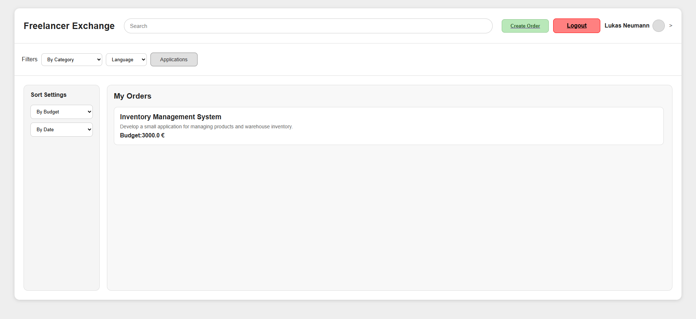
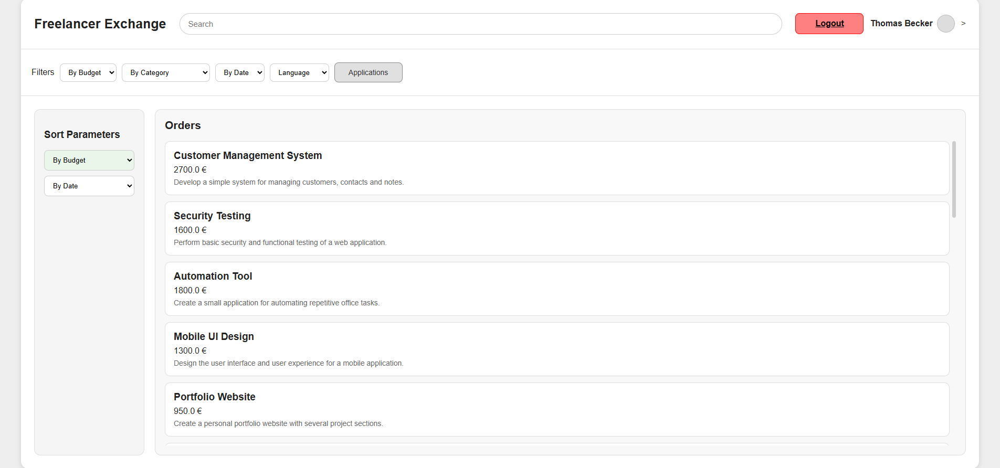
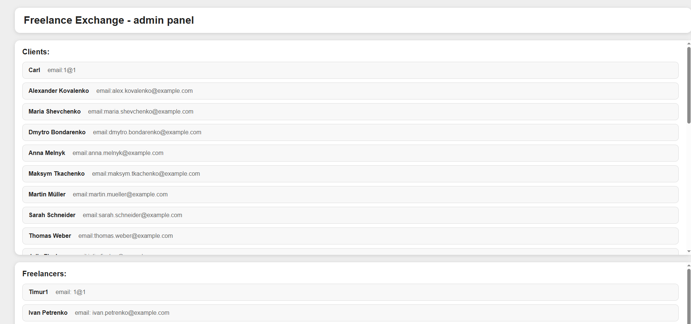
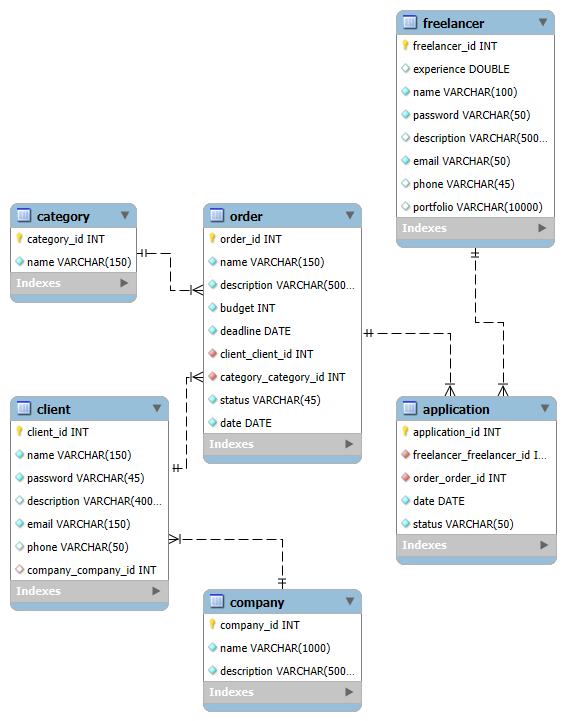

# Freelancer Exchange

## Description

**Freelancer Exchange** is a web platform for communication and interaction between clients and freelancers.

The platform allows clients to create projects, while freelancers can browse available projects and submit applications for them.

Clients and freelancers are represented as separate user types in the database. Therefore, the same person can have separate client and freelancer accounts using the same authentication data.

The project was developed using **Java**, **Spring MVC**, and **Thymeleaf**. The user interface was implemented using **HTML and CSS**.

This is my first large-scale Java project. During development, I focused primarily on the backend and database interaction. Most of the technologies used in the project, except Java, were learned while developing the application.

Some technologies and tools used in the project were also learned during development, so certain parts of the application may require further refactoring.

### Client Main Page



### Freelancer Main Page



### Admin Main Page



## Technologies

- Java
    
- Spring MVC
    
- Thymeleaf
    
- MySQL
    
- JDBC / `JdbcTemplate`
    
- HTML
    
- CSS
    
- Maven
    

## Architecture

The application is divided into several main types of classes.

### Controller

Controllers handle HTTP requests from users, receive the required parameters, and pass the necessary information to the corresponding `Service` methods.

Controllers are also responsible for determining which page should be returned to the user.

### Service

The `Service` layer contains the business logic of the application.

It processes data received from controllers and interacts with the database through DAO classes.

### DAO

DAO classes are responsible for direct interaction with the database.

They contain SQL queries for retrieving, inserting, updating, and deleting data.

### RowMapper

`RowMapper` classes convert the results of SQL queries into objects of the corresponding model classes.

This separates the processing of SQL query results from the main DAO logic.

### Model

Model classes represent the data used by the application and correspond to entities in the database.

They are used to store and transfer data between different layers of the application.

## Common Classes

The project also contains classes with common functionality that is used in multiple parts of the application.

### BaseDAO

`BaseDAO` contains commonly used basic database operations that can be reused by other DAO classes.

## Database

Database schema:



## Internationalization

The project supports multiple interface languages:

- English
    
- Deutsch
    
- Українська
    

Translations are stored in separate `.properties` files:

```text
messages.properties
messages_en.properties
messages_de.properties
messages_ua.properties
```

## Features

### General

- User registration
    
- User authentication
    
- Profile editing
    

### Client

- Edit company information
    
- View own projects
    
- Sort own projects
    
- Create projects
    
- Edit own projects
    
- Delete own projects
    
- View applications submitted for own projects
    
- Accept or reject applications for own projects
    

### Freelancer

- View all available projects
    
- Sort projects
    
- Submit applications for projects
    
- View own applications
    
- Delete own applications
    

### Admin

- View all users
    
- Edit user information
    

## Setup

To run the application, you need to create a MySQL database and configure the database connection in:

```text
src/main/resources/application.yml
```

Example configuration:

```yaml
spring:
  datasource:
    url: jdbc:mysql://localhost:3306/yourDB
    username: username
    password: password
    driver-class-name: com.mysql.cj.jdbc.Driver
```

After configuring the database, the application can be started using Maven or directly from an IDE.

## Current Limitations

The project is still under development. The current limitations include:

- User passwords are currently stored without hashing.
    
- Search and advanced filtering have not yet been implemented.
    
- The user interface design requires further improvement.
    
- Some of the CSS was created using AI tools based on a UI structure and visual design created by me.
